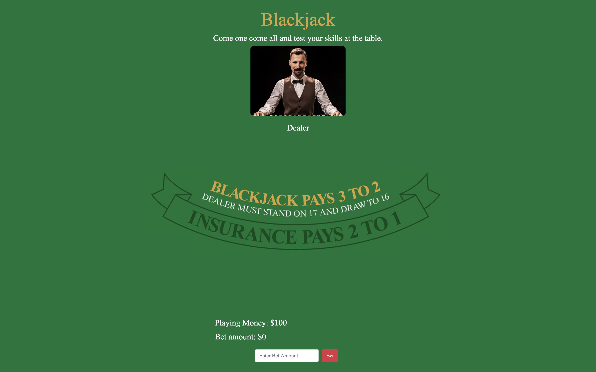
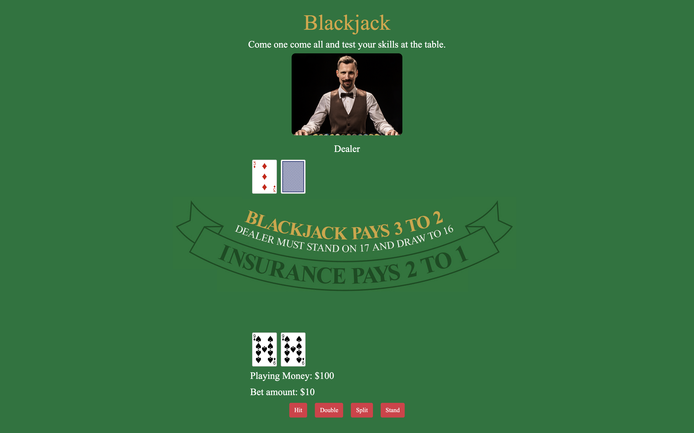
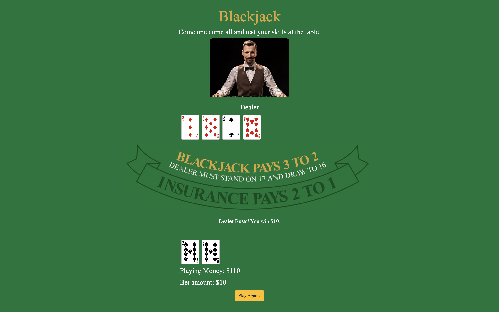

# Blackjack Game

Welcome to the Blackjack table. Just like the casino, the goal of the game is to beat the dealer's hand without going over 21. 

---

## Blackjack Rules

- Face cards are worth 10. Aces are worth 1 or 11, whichever makes a better hand.
- Each player starts with two cards, one of the dealer's cards is hidden until the end.
- To 'Hit' is to ask for another card. To 'Stand' is to hold your total and end your turn.
- If you go over 21 you bust, and the dealer wins regardless of the dealer's hand.
- If you are dealt 21 from the start (Ace & 10), you got a blackjack (unless the dealer also has an Ace & 10, which is a draw). 
    - Blackjack means you win 1.5 the amount of your bet.
- Dealer will hit until his/her cards total 17 or higher.
- Doubling is like a hit, only the bet is doubled and you only get one more card. 
- Split can be done when you have two of the same card - the pair is split into two hands.
    - Splitting also doubles the bet, because each new hand is worth the original bet.
- You can only double/split on the first move, or first move of a hand created by a split.
- You can double on a hand resulting from a split, tripling or quadrupling you bet.

---

## Screenshots of Gameplay

### Initial Setup Screenshot

### Dealt Hand Screenshot

### Winning Game Screenshot

---

## Technologies Used
- HTML
- CSS
- JavaScript

---

## Getting Started

https://davidharris319.github.io/blackjack-project/

--- 
## Next Steps

1. **Split Function:** Adding more functionality to the split function, allowing players to split multiple times on a hand if multiples of the same card were drawn. 
    - Also improve the UI for taking cards from a split hand. 

2. **Insurance:** Add an insurance capability to the game. Insurance is a side bet that the dealer has blackjack, it plays out independently of your original wager.

3. **Counts:** Add player and dealer counts to the UI. 

4. **Wager Messages** Add wager messages for players when they have not bet correctly. 

5. **Refactor:** Refactor javaScript to provide a cleaner code base.